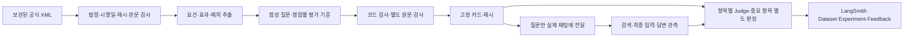

# 공식 원문 기반 자동 질문·평가 카드

구현 기준: 2026-10-04. 진입점은 `scripts/evaluate.py auto`다.
기존 수동 평가셋·인간 승인·LangSmith 게시 명령과 별도로 실행한다.

## 동작



- 교사 원문은 `law_history.versions/snapshots`에서 읽는다. 벡터·BM25·Graph 검색 결과로 정답 기준을 만들지 않는다. 새로운 법령 수집이나 운영 DB 변경은 없다.
- 가장 최근의 **보관된** 적용 후보 버전을 먼저 선택한다. 해당 버전의 원문이 없으면 더 오래된 완료본으로 몰래 대체하지 않는다. 실시간 최신 법령 인증은 수행하지 않는다.
- 법률·시행령·시행규칙의 전체 조문을 제한적으로 샘플링한다. 부칙은 최근 한 단위를 보존하고 전체 경과규정 미확보를 기록한다. 입력 상한 240,000 UTF-8 bytes를 넘으면 자르지 않고 오류/판단 불가로 남긴다.
- 법인세·부가가치세·소득세·양도소득세·상속세·증여세 × 일반·예외·정보 부족·복합·시점의 기본 **30개 생성 시도**다. 30개 모두 채택되는 것을 보장하지 않는다.
- 카드는 질문 원문, 사실관계, 사건일, 주체·세목·요청별 쟁점, 필수/금지 판단, 조건, 통과/실패 기준, 정확한 원문 인용을 저장한다. 하나의 모범 답변과 문자열 일치로 채점하지 않는다.
- 형식·ID·실제 인용·질문의 사실/날짜 포함 여부를 코드로 검사한다. 모델은 원문 `span_id`를 선택하고 서버가 해당 구간을 복원해 긴 인용 복사 오류를 막는다. 별도 호출이 원문 지지·사실 충실성·쟁점 충족·답변 가능성·시점의 5개 항목을 감사한다. 모두 pass인 카드만 `auto_validated`로 고정한다. 유효한 fail/unknown은 통과할 때까지 재생성하지 않는다.
- 같은 원문을 공유하는 변형·복합 질문은 연결된 그룹으로 묶는다. 전체가 연결되면 모두 dev이며 `independent_holdout_available=false`다. 자동 split을 전문가 holdout으로 취급하지 않는다.
- 생성/감사는 기존 `question_planning`/`answer_judge` 작업 설정을 사용한다. OpenRouter `openai/gpt-6-luna`, Ollama `qwen3-embedding:4b`/v1 및 8개 LLM 작업을 유지한다.

## 실행

최신 백엔드 이미지에서 수행한다. 경로마다 새 배치를 사용한다.

```bash
# 6분야 일반 질문: 생성 → 실제 채팅 → 자동 평가 → LangSmith 게시
docker exec tax_backend python scripts/evaluate.py auto pipeline \
  --output /tmp/auto-evaluation-NEW --as-of 2026-10-04 \
  --types general --publish --region us

# 기본 30개를 생성하되 첫 실제 답변 검증은 일반 질문만 실행
docker exec tax_backend python scripts/evaluate.py auto pipeline \
  --output /tmp/auto-matrix-NEW --as-of 2026-10-04 \
  --eval-types general --publish

# 동일 옵션으로 중단된 단계 재개
docker exec tax_backend python scripts/evaluate.py auto pipeline \
  --output /tmp/auto-matrix-NEW --as-of 2026-10-04 \
  --eval-types general --publish --resume

# 컨테이너 재생성 전에 원문·체크포인트·결과·게시 영수증 전체 보존
docker cp tax_backend:/tmp/auto-matrix-NEW evaluation/runs/auto-matrix-NEW
```

`--publish`가 없으면 외부 게시하지 않는다. 게시 키는 실행 환경의
`TAX_EVAL_LANGSMITH_API_KEY`, 없으면 `LANGSMITH_API_KEY`를 사용한다.
기존 수동 게시 명령의 `.env.example` 읽기 규약은 변경하지 않는다.
리전은 `--region us|eu`로 지정한다.

단계를 따로 실행할 수도 있다.

```bash
python scripts/evaluate.py auto build --output evaluation/runs/cards-NEW --as-of 2026-10-04
python scripts/evaluate.py auto validate --cards evaluation/runs/cards-NEW
python scripts/evaluate.py auto run --cards evaluation/runs/cards-NEW \
  --output evaluation/runs/answer-NEW --types general --publish
python scripts/evaluate.py auto publish --cards evaluation/runs/cards-NEW \
  --run-dir evaluation/runs/answer-NEW
# 저장된 동일 답변만 새 Judge로 평가: 채팅 재실행 없음
python scripts/evaluate.py auto run --cards evaluation/runs/cards-NEW \
  --from-run evaluation/runs/answer-BASE --output evaluation/runs/rejudge-NEW --publish
python scripts/evaluate.py auto compare \
  --baseline evaluation/runs/answer-BASE/experiment.json \
  --candidate evaluation/runs/answer-NEW/experiment.json
# 저장 결과의 주장 차단 사유 × Judge 판정 집계: 모델 호출 없음, 여러 실행 가능
python scripts/evaluate.py auto blocks evaluation/runs/answer-NEW \
  --output evaluation/runs/answer-NEW/blocks.json
# 저장된 정상 주장에 알려진 오류를 넣어 검사별 탐지 측정: 기본은 모델 호출 없음
python scripts/evaluate.py auto filters evaluation/runs/answer-NEW --cards evaluation/runs/cards-NEW \
  --output evaluation/runs/answer-NEW/filters.json
# 같은 변형을 Judge에도 보여 코드만/Judge만 잡는 오류를 구분: 실제 모델 호출
python scripts/evaluate.py auto filters evaluation/runs/answer-NEW --cards evaluation/runs/cards-NEW --judge
```

`run --taxes corporate vat`/`--types compound temporal`/`--split dev|test|all`/
`--limit N`으로 실행 범위를 정한다. 같은 고정 카드·선택 목록의 실행만 compare할 수 있다.
코드/모델/검색 설정을 바꾼 실험은 새 출력 폴더에서 실행한다. `--resume`은 변경된 설정을 거부한다.

`auto blocks`는 보류된 주장을 공개 검사 코드별로 세고 같은 주장의 Judge 판정과 교차한다.
`false_block_candidates`는 Judge가 supported인데 결정적 검사가 막은 주장이고, `sole_blocker`는
그 코드 하나만으로 막힌 수다. `cases_without_claims`는 라우팅·도구·계획에서 끝나 주장 공개 단계에
도달하지 못한 사례다. Judge는 독립 세무 정답이 아니므로 이 표는 점검할 검사의 순서이며
검사 오류의 입증이 아니다. 코드 분류(integrity/repairable/evidence)는
`app/services/claim_verification.py`의 재생성 피드백과 같다.

`auto filters`는 저장 실행에서 현재 검사를 모두 통과하는 주장을 씨앗으로 고르고, 없는 조문·조문 번호 이동·
지어낸 세액·인용 변조·다른 세목·다른 주체·결론 뒤집기·예외 삭제·다른 근거 연결을 하나씩 넣어 어느 검사가 잡는지
센다. `--judge`면 씨앗과 변형을 Judge에도 보이고 `only_code`(코드만 잡음)·`only_judge`·`missed`를 나눈다.
검사별 `false_block_candidates`는 같은 실행의 `auto blocks` 값이다. 코드만 잡는 오류가 있는 검사는 차단을 유지하고,
Judge와 겹치면서 오탐이 많은 검사는 신호로 낮출 후보다. 합성 변형의 수치이며 실제 정확도 입증이 아니다.

## 실제 채팅 평가와 LangSmith

- 별도 순차 CLI 프로세스에서 실제 `process_chat`을 실행한다. 서비스에는 **질문만** 전달하며 기준·기대 조문·골드 필터를 주입하지 않는다. 빈 대화 이력과 임의 사용자 UUID로 개인 문서를 격리하고 대화 저장과 웹 검색, 중복 추적을 끈다. HTTP/SSE/브라우저 E2E 검사는 아니다.
- 실제 실행 전 BM25 준비를 최대 120초 기다려 초기 색인 준비와 질문 지연을 구분한다. 준비 실패는 기록하며 기존 검색 fallback을 유지한다. 검색 결과, 쟁점 계획/coverage, 생성에 실제 들어간 원문, 초안, 공개된 최종 답변, 도구/verification 상태, 지연을 관측한다. 런타임 Judge의 통과 판정을 독립 평가 정답으로 재사용하지 않는다.
- R1은 실제 최종 생성 입력의 법령/조문/시행일/본문 해시/필수 인용을 대조한다. 모든 검색 후보의 top-K recall/MRR 측정과는 다르다.
- R2는 기대 조문과 다른 버전의 혼입을 탐지한다. 미라벨 후보를 hard negative로 간주하지 않아 다른 경우는 unknown이다. G1은 별도 관계 원문 감사가 없어 그래프가 사용되면 unknown이다. 그래프 미사용은 G1/G2에 해당 없음이다.
- A1 결론, A2 근거 충실성, A3 완전성, A4 인용 의미, A5 시점, A6 적절한 유보, 그래프 사용 시 G2 유용성을 평가한다. 모델은 답변 구간 ID와 허용된 근거/기대 판단 ID만 선택하고 서버가 정확한 답변 발췌를 복원한다. A1/A5/A6는 첫 판정을 보여주지 않는 별도 호출도 수행하고 불일치는 unknown으로 남긴다.
- 이 버전은 독립 숫자 oracle 없는 확정 세액 문제를 생성하지 않는다. T1은 해당 없음이다. 기존 결정적 계산 테스트는 별도 경로이며 세액 기대값 자동 구축은 후속이다.
- fail/unknown/error/해당 없음을 각각 집계한다. fail 하나라도 있으면 사례 fail, fail 없이 unknown/error가 있으면 incomplete다. R2/G1 제한으로 평가 배치가 정상 완료돼도 사례 전체가 incomplete일 수 있다.
- LangSmith에는 합성 질문, 기대 기준/공식 원문, 최종 답변, 항목별 이유와 증거, `diagnostic.auto.*` feedback을 게시한다. pass/fail만 1/0 점수이고 unknown/error/N/A는 문자열 상태다. 실제 응답 시간은 `observed_elapsed_seconds`를 사용한다. LangSmith 기본 실행 시간은 저장 결과의 게시 시간이다.
- Dataset 이름은 `tax-eval-<해시>`, Experiment 이름은 `tax-eval-system-<해시 앞 24자>`다. `langsmith-receipt.json`에 실제 원격 ID를 기록한다. 생성 카드 전부가 아니라 **선택해 평가한 카드**가 해당 Dataset에 올라간다.
- 공개 법령/합성 사례만 자동 게시한다. 관측된 사용자 문서가 있으면 거부한다. 같은 계획의 완료 영수증은 재사용해 중복을 막는다. 부분 게시 영수증은 원격 상태를 확인하기 전 자동 재전송하지 않는다.

## 결과·중단·한계

| 산출물 | 내용 |
|---|---|
| `cards/snapshots/*.xml` | 해시 검증 대상 공식 보관 원문 |
| `cards/build-state.json` | 완료 단계·규칙 캐시·감사 대기 후보·실패 |
| `cards/cards.json`, `cards.md`, `build-summary.json` | 고정 카드·읽기용 질문 목록·채택/실패 현황 |
| `run/experiment.json`, `report.md` | 실제 관측·11항목 상태/이유·버전/코드 해시·답변 |
| `run/langsmith-plan.json`, `langsmith-receipt.json` | 고정 게시 범위·원격 ID/완료 여부 |

원문과 저장 관측을 재개 전에 다시 검사한다. 채팅 관측은 Judge 호출 전에 저장하므로
평가 중 중단됐다고 이미 생성한 채팅 답변을 다시 실행하지 않는다. 카드 감사 중 통신 오류는
질문 후보를 보존해 재개한다. 의미상 불합격·결정적 형식 오류는 완료된 실패로 보존한다.
정상 종료는 `.active.lock`을 제거한다. 강제 종료로 남은 잠금은 해당 CLI가 종료됐음을
확인한 뒤 그 배치의 잠금 파일만 제거한다.

`run --from-run`은 원래 데이터셋/카드/관측 해시를 검증해 저장된 답변만 새 Judge로
평가한다. 기존 관측을 수정하거나 검색/채팅을 재실행하지 않는다. 원래 생성 코드 해시와
런타임, 현재 Judge 코드/프롬프트를 별도로 기록한다. 실제 서비스를 새로 테스트한 결과와 구분한다.

CLI 종료 코드: 0=범위 내 정상 완료, 1=답변 평가 실패/회귀, 2=판단 미완료 또는 채택 카드 없음,
3=실행/검증/게시 오류. `build`는 일부 채택되면 0이므로 실패 건수도 확인한다.
판정 실패여도 `--publish`는 결과를 게시하며 실패를 성공으로 바꾸지 않는다.

카드는 항상 `human_approved=false`다. 기존 인간 승인/공식 scorer gate를 통과시키지 않는다.
같은 모델의 별도 감사는 호출 독립성만 제공한다. 전문 세무 정답률, Judge의 오답 통과율,
최신성·부칙의 완전성은 독립 검수로 별도 입증해야 한다. 예약 실행은 추가하지 않았다.
